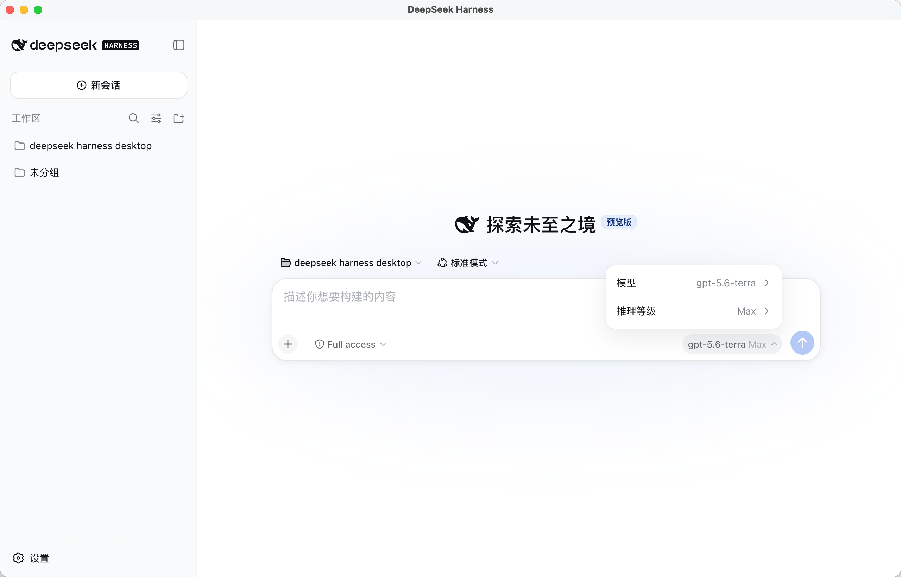
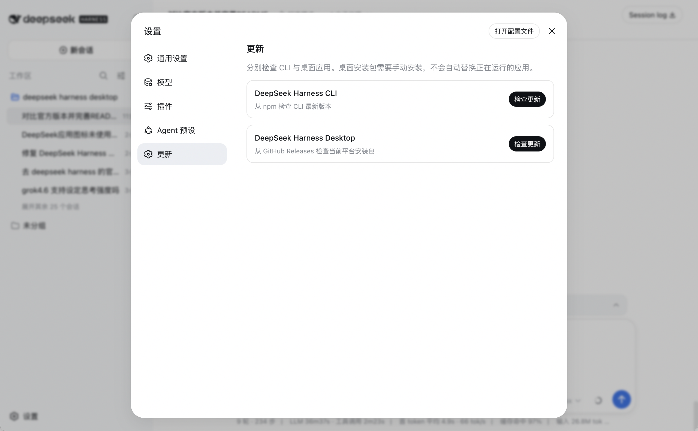

# DeepSeek Harness Desktop

把 [DeepSeek Harness](https://github.com/deepseek-ai/deepseek-harness) 变成一个更方便使用的桌面应用。

当前版本：`v0.1.4`

支持 macOS、Windows 和 Linux。

## 实际界面

### 主界面



### 设置与更新



## 它能做什么？

- 像普通桌面软件一样打开 DeepSeek Harness
- 第一次打开时，自动准备 Node.js 和 DeepSeek Harness
- 不需要用户提前安装 DeepSeek Harness
- 支持在设置里更新 Harness 和桌面应用
- 在设置 → 插件中增加“论坛插件”，可以浏览 GitHub 上的 DSH 插件
- 支持复制、粘贴和常用快捷键
- 支持发送图片
  - DeepSeek 模型保持官方的纯文本限制
  - 其他模型默认尝试发送图片，如果模型不支持，会显示服务商返回的错误
- 支持发送文本和代码文件
  - 点击输入框左下角的回形针按钮选择文件
  - 也可以把文件直接拖到输入框
  - 支持 TXT、Markdown、JSON、CSV 和常见代码文件
  - 单个文件最大 1 MB，一次最多 5 个文件
  - PDF、Word、Excel 等文件暂时不支持
- 支持 macOS、Windows 和 Linux

## 安装使用

### 普通用户

从 [Releases](https://github.com/hx876298682-tech/deepseek-harness-desktop/releases) 下载对应系统的安装包：

- macOS Apple Silicon：下载 `arm64.dmg`
- macOS Intel：下载 `x64.dmg`
- Windows：下载 `.exe`
- Linux：下载 `.AppImage`

安装后直接打开即可。

第一次打开时需要联网，软件会自动下载运行所需的文件。以后打开不需要重复下载。

### macOS 提示

目前安装包没有 Apple 官方签名。如果系统提示无法打开：

1. 右键点击应用
2. 选择“打开”
3. 再点击“打开”确认

## 更新软件

打开应用左下角的“设置”，进入“更新”：

- **DeepSeek Harness CLI**：更新官方 Harness
- **DeepSeek Harness Desktop**：更新桌面应用

桌面应用更新会下载新的安装包，需要用户手动安装，不会直接替换正在运行的软件。

## 从源码运行

需要安装 Node.js 和 npm：

```bash
npm ci
npm start
```

运行测试：

```bash
npm run test:update-utils
```

构建安装包：

```bash
# macOS Apple Silicon
npm run dist:mac-arm64

# macOS Intel
npm run dist:mac-x64

# Linux
npm run dist:linux

# Windows
npm run dist:win
```

## 常见问题

### 需要提前安装 DeepSeek Harness 吗？

不需要。桌面应用第一次启动时会自动准备 Node.js，并自动安装官方 Harness。

### 第一次打开失败怎么办？

请确认网络正常，然后重新打开应用。如果仍然失败，可以查看应用日志：

```text
dsh-desktop.log
```

### 如何发送文件？

点击输入框左下角的回形针按钮，选择文本或代码文件。也可以直接把文件拖到输入框里。

目前支持 TXT、Markdown、JSON、CSV 和常见代码文件。文件内容会以文字的形式放进消息，并带上文件名。

单个文件不能超过 1 MB，一次最多选择 5 个文件。PDF、Word、Excel 等文件暂时不支持。

### 为什么有些模型不能发图片？

不同模型的能力不一样。桌面端会先尝试发送图片，如果模型或服务商不支持，接口会返回错误。DeepSeek 官方模型仍按官方规则只支持文本。

## 说明

本项目是官方 DeepSeek Harness 的桌面外壳，不是官方 Harness 核心代码的复制版。官方项目仍在持续开发中，后续可能会有功能变化。

官方仓库：[deepseek-ai/deepseek-harness](https://github.com/deepseek-ai/deepseek-harness)

DSH 插件论坛：[github.com/topics/dsh-plugin](https://github.com/topics/dsh-plugin)

本项目仓库：[deepseek-harness-desktop](https://github.com/hx876298682-tech/deepseek-harness-desktop)

## 许可证

[MIT License](LICENSE)
